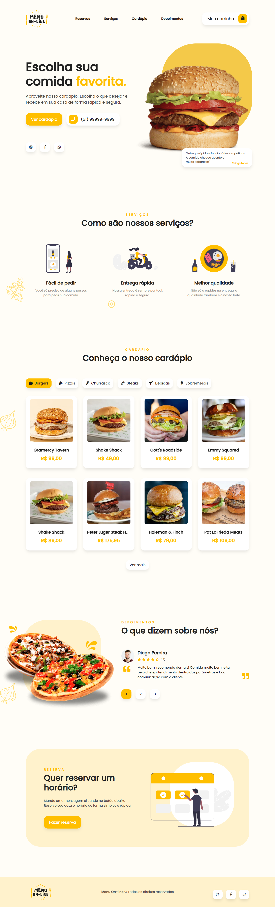
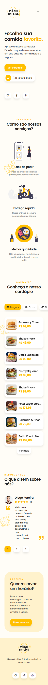

# Cardápio online com WhatsApp! 

## Resumo

Cardápio online é uma Landing Page interativa e responsiva, com diversos produtos, como: Hamburgues, pizzas, churrascos, bebidas e muito mais onde o usuário pode fazer seus pedidos via WhatsApp e fazer Reservas também, com integração de API de busca de CEP para Delivery e API do WhatsApp, e também possui animações poderosas com o "Animate.css e WOW.js"  
(Também fiz pequenos ajustes e mudanças para uma melhor experiência do usuário)

obs: (Este é apenas demonstrativo, a versão final esta mais atualizada, interativa, responsiva e com outras funções para melhor experiência de usuário.)

## Tecnologias utilizadas

    
    
    
    
    

## Ferramentas utilizadas

    
    
    
    

## Sobre o Projeto

<ul>
    <li>Landing page Interativa.</li>
    <li>Carrinho de compras.</li>
    <li>Cardápio completo.</li>
    <li>Depoimentos de clientes.</li>
    <li>Pedido pelo WhatsApp.</li>
    <li>Design responsivo.</li>
    <li>Animações com Animate.css e WOW.js.</li>
    <li>Ícones do Font-Awesome.</li>
    <li>API de busca de CEP.</li>
    <li>Delivery.</li>
    <li>Pedido por WhatsApp.</li>
    <li>Reservar pedido por WhatsApp.</li>
    <li>Sem necessidade de cadastro.</li>
    <li>Função Aberto ou Fechado. *(Apenas na versão final!)</li>
    <li>Cliente escolhe entre Retirada ou Delivery. *(Apenas na versão final!)</li>
    <li>Formas de pagamento. *(Apenas na versão final!)</li>
    <li>Função frete grátis num valor determinado, e outros requisitos. *(Apenas na versão final!)</li>
</ul> 

## Imagem completa do site
### Desktop

### Mobile

## Acesse o Projeto

Você pode acessar o projeto através do link abaixo:

➜ [Link do Menu online](https://ezequiel-lee.github.io/menu-teste/)

## Agradecimentos

(Agradecimentos ao Weverton Lima pelo excelente conteúdo e estudo.)